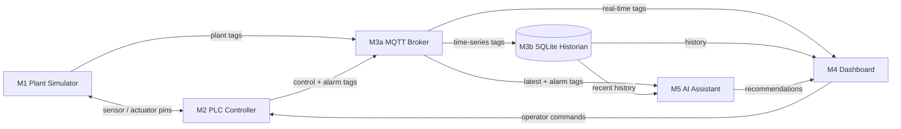

# Smart Beverage Pasteurization & Bottling Line — Digital Twin

**TUMA206 Group 1** · Deployed by **Escanes0723**

A complete industrial digital twin of a beverage pasteurization and bottling line, built as a pure-Python implementation of the Purdue enterprise reference architecture across five ISA-95 layers: physical process simulation → PLC control → MQTT data transport → operator dashboard → AI-assisted diagnostics.

---

## ⚠️ Important: How This System Works

> **The cloud URL is NOT a standalone website.** It is only a **display window** — like a TV screen. The actual data comes from YOUR computer running `local_backend.py`.

```
别人打开 Cloud URL ──→ 能看到页面（深色 UI、KPI 卡片、趋势图）
                         但显示 "No data" ❌

只有当你电脑上跑着 local_backend.py ──→ 页面才有实时数据 ✅
```

**如果你关掉电脑或停止 `local_backend.py`，任何人都看不到数据 — 页面能打开，但一片空白。**

---

## 🖥️ Run On Your Own Computer

### Step 1 — Download & Install

```bash
git clone https://github.com/Escanes0723/TUMA206-digital-twin-V5.git
cd TUMA206-digital-twin-V5
python -m venv .venv
.venv\Scripts\activate      # Windows
pip install -r requirements.txt
```

### Step 2 — Start the Engine (REQUIRED)

**This is the most important step.** Without this, there is no data — neither local nor cloud will show anything.

```bash
# Terminal 1: Start the simulation engine + MQTT publisher
python local_backend.py
```

You must see this output:
```
[MqttBus] connected to 3c57522d5f2e469d8ced051055a5bf1f.s1.eu.hivemq.cloud:8883
Line auto-started — cloud dashboard will show live data.
```

### Step 3 — Open the Dashboard

**Local dashboard** (full control: START/STOP, faults, manual override):

```bash
# Terminal 2: Start local dashboard
streamlit run dashboard/app.py --server.port 8501
```
Open → **http://localhost:8501**

**Or** use the one-click launcher: double-click `START_ALL.bat`.

### Step 4 — (Optional) Check the Cloud Dashboard

Once `local_backend.py` is running, open your cloud URL in any browser, from any device:

→ **https://tuma206-digital-twin-v5-twhnsbpxc5hnue2iubzra4.streamlit.app/**

It shows the same live data — but read-only (no control).

---

## ☁️ Deploy Your Own Cloud Dashboard

If you want your OWN cloud URL (independent from Escanes0723's deployment):

### 1. Fork & Customize

```bash
# Fork this repo on GitHub, then clone YOUR fork
git clone https://github.com/YOUR_USERNAME/TUMA206-digital-twin-V5.git
cd TUMA206-digital-twin-V5
```

**Change the MQTT topic prefix** to something unique in these two files:
- `.env`: `MQTT_TOPIC_PREFIX=tuma206grp1bvg_YOUR_SUFFIX`
- `cloud_app.py` line 5: `os.environ["MQTT_TOPIC_PREFIX"] = "tuma206grp1bvg_YOUR_SUFFIX"`

### 2. Deploy to Streamlit Cloud

1. Push to your GitHub
2. Go to [share.streamlit.io](https://share.streamlit.io) → New app
3. Select your repo, Main file = `cloud_app.py`
4. Settings → Secrets, add:

```toml
MQTT_HOST = "3c57522d5f2e469d8ced051055a5bf1f.s1.eu.hivemq.cloud"
MQTT_PORT = "8883"
MQTT_TLS = "1"
MQTT_USERNAME = "tumademo"
MQTT_PASSWORD = "Tuma2026demo"
```

5. Settings → Sharing → **Public** (so anyone can open the URL without login)
6. Save → Reboot → Done! Your cloud URL is live.

### 3. Run your engine

```bash
python local_backend.py
```

Now **anyone** opening your cloud URL sees YOUR live data.

---

## Architecture

```
你的电脑 (Local)                         Streamlit Cloud (Cloud)
┌─────────────────────────┐            ┌──────────────────────────┐
│ local_backend.py        │   MQTT     │ cloud_app.py             │
│ (唯一模拟引擎 + PLC)    │ ────────→  │ (只读显示，深色主题UI)    │
│                         │  HiveMQ   │                          │
│ localhost:8505          │  Cloud    │ tuma206-digital-twin-v5  │
│ (remote模式，读MQTT)    │           │ .streamlit.app           │
└─────────────────────────┘            └──────────────────────────┘
```

| 组件 | 地址 | 说明 |
|------|------|------|
| **Local Dashboard** | `http://localhost:8505` | 全功能控制面板，remote 模式读 MQTT |
| **Cloud Monitor** | `https://tuma206-digital-twin-v5-twhnsbpxc5hnue2iubzra4.streamlit.app/` | 只读深色主题仪表盘 |
| **Simulation Engine** | `local_backend.py` | 唯一数据源，发布到 MQTT |

### MQTT Topic

| | Shared (旧) | Unique (新) |
|---|---|---|
| Prefix | `tuma206grp1bvg` | `tuma206grp1bvg_escanes0723` |
| Tags topic | `tuma206grp1bvg/tags` | `tuma206grp1bvg_escanes0723/tags` |
| Data | 全班共享，tick 乱跳 | 专属，数据干净 |

> If you deploy your own fork, change `MQTT_TOPIC_PREFIX` to a unique value in `.env` and `cloud_app.py` to avoid data collision.

### Data Flow

```
local_backend.py (引擎)
   │  tick=1,2,3...
   │  每 5 秒发布一次 MQTT 消息
   │
   └──→ tuma206grp1bvg_escanes0723/tags (HiveMQ Cloud)
          │
          ├──→ localhost:8505 (remote 模式，显示实时数据)
          │
          └──→ Streamlit Cloud App (深色主题，KPI卡片+趋势图+报警)
```

### Why two dashboards show the SAME tick

Both `localhost:8505` and the cloud dashboard read from **the same MQTT data stream** published by `local_backend.py`. There is only ONE simulation engine. If you want a self-contained local dashboard (separate engine), run without `DASHBOARD_MODE=remote`:

```
streamlit run dashboard/app.py --server.port 8501
```

But then localhost and cloud will show different ticks (different engines).

---

## Cloud Deployment

### How to deploy your own cloud dashboard

1. **Fork this repo** to your GitHub account
2. Go to [share.streamlit.io](https://share.streamlit.io) → New app
3. Select your repo, set Main file path = `cloud_app.py`
4. In Settings → Secrets, add:

```toml
DASHBOARD_MODE = "remote"
MQTT_HOST = "3c57522d5f2e469d8ced051055a5bf1f.s1.eu.hivemq.cloud"
MQTT_PORT = "8883"
MQTT_TLS = "1"
MQTT_USERNAME = "tumademo"
MQTT_PASSWORD = "Tuma2026demo"
MQTT_TOPIC_PREFIX = "tuma206grp1bvg_YOUR_UNIQUE_SUFFIX"
```

5. Change `MQTT_TOPIC_PREFIX` in `cloud_app.py` line 10 to match
6. Save → Reboot → your cloud URL is live

### Common issues

| Symptom | Cause | Fix |
|---------|-------|-----|
| Cloud black screen | `st.set_page_config` not first, or engine init blocking | Already fixed — lazy engine init |
| Tick jumping wildly | Multiple backends on same MQTT topic | Use unique `MQTT_TOPIC_PREFIX` |
| Cloud shows "No data" | `local_backend.py` not running | Start it: `python local_backend.py` |
| Cloud URL requires login | App visibility = Private | Settings → Sharing → Public |

---

## Smoke Test

```bash
python scripts/run.py --ticks 30
```

---

## Table of Contents

1. [System Architecture](#system-architecture)
2. [Module Specification](#module-specification)
3. [Process Pipeline](#process-pipeline)
4. [Control Strategies](#control-strategies)
5. [Sequential Startup](#sequential-startup)
6. [Thermal Physics](#thermal-physics)
7. [Fault Injection & Alarm System](#fault-injection--alarm-system)
8. [Dashboard](#dashboard)
9. [Cloud Monitoring Dashboard](#cloud-monitoring-dashboard)
10. [Repository Structure](#repository-structure)
11. [Key Configuration](#key-configuration)
12. [Technology Stack](#technology-stack)

---

## System Architecture

The system follows the **Purdue Enterprise Reference Architecture** (PERA), adapted for a single-line beverage process:

```
ISA-95 Layer 4 (Enterprise)     M5 AI Assistant        —— diagnosis + operator recommendations
ISA-95 Layer 3 (Manufacturing)   M4 Dashboard           —— HMI: P&ID, trends, alarms, fault injection
ISA-95 Layer 2 (Control)         M3 Data Layer          —— MQTT pub/sub + SQLite historian
ISA-95 Layer 1 (Sensors)         M2 PLC Controller      —— state machine + PI control + fault detection
ISA-95 Layer 0 (Process)         M1 Plant Simulator     —— physics: thermal, flow, bottling
```



**Key architectural rule:** the closed-loop control path exists **only** between M1 (Plant) and M2 (PLC). M5 (AI) recommends operator actions but never directly controls actuators. M4 injects faults and applies manual overrides through M2 — never bypasses it.

The system advances one **tick** per simulated second. Each tick: M1 publishes sensor values → M2 reads them, runs control logic, outputs actuator commands → M1 applies commands → M3 publishes the combined tag snapshot and persists it to SQLite.

---

## Module Specification

### M1 — Plant Simulator (`simulator/plant.py`)

A physics-only model. Receives actuator commands and fault-injection codes; produces sensor readings. Contains **no control logic**.

```
module M1_PlantSimulator (
    input  pump_cmd, inlet_valve_cmd, heater_power_cmd,
    input  cooling_valve_cmd, conveyor_cmd, fill_valve_cmd, capper_cmd,
    input  fault_inject_code, reset_fault,
    output tank_level, pasteur_temp, cooler_temp, flow_rate,
    output bottle_count, bottles_completed, conveyor_queue,
    output pump_feedback, valve_feedback,
    output fill_phase, fill_progress, nozzle_status[4], fault_status
)
```

| Subsystem | Model | Key Parameters |
|-----------|-------|---------------|
| Raw Tank | Mass balance: `inflow(6.0×valve%) − outflow(4.0×pump%)` tank-%/tick | Starts empty, fills on START |
| Feed Pump | `flow_rate = 40.0 × pump%` ± noise | 0–40 L/min |
| Pasteurizer | Heating (τ≈12s) + flow-through cooling + noise | Target = 25°C + heater%×65°C (max 90°C) |
| Cooler | Pipe transit (inlet ~53°C) + active glycol HX (floor 15°C) | AUTO valve ~43% at 25°C |
| Filler | 4-nozzle inline monoblock: INDEX(gap 1–3t) → FILL → discharge | 500 mL/bottle, 4 per carrier |
| Conveyor | Continuous float buffer: `min(buf, 1.5×conv%/100)` bottles/tick | Capacity 60, target 12 |

### M2 — PLC Controller (`plc/controller.py`)

Scan-cycle PLC emulation. State machine, PI/P loops, 8-alarm fault detection every tick.

```
module M2_PLCController (
    input  tank_level, pasteur_temp, cooler_temp, flow_rate,
    input  bottle_present, pump_feedback, valve_feedback,
    input  operator_start, operator_stop, manual_overrides,
    output pump_cmd, inlet_valve_cmd, heater_power_cmd,
    output cooling_valve_cmd, conveyor_cmd, fill_valve_cmd, capper_cmd,
    output alarm_code, plc_state, startup_phase
)
```

**State Machine:**

```
IDLE ──[START]──> STARTING(HEAT) ──[temp+level OK]──> STARTING(PRIME) ──[flow>5]──> RUNNING
  ^                    ^                                     |                          |
  |                    |                                     v                          |
  |                    └─────────────── [serious alarm] ─── FAULT ───[acknowledge]─────┘
  └───[STOP]──────────────────────────────────────── STOPPING ──[1t]── IDLE
```

| Stage | Method | Detail |
|-------|--------|--------|
| S1 Inlet Valve | Feed-forward + P trim | FF = `pump%×67%`. Trim = `−3.0×level_error`. Cascade with pump. |
| S1 Feed Pump | Proportional + smoothing | 30–100% proportional to tank level; smoothing 0.4 |
| S2 Pasteurizer | PI + anti-windup + adaptive gain | SP 72°C, gain 1.5–5.0 flow-adaptive, true anti-windup |
| S3 Cooler | PI + anti-windup | SP 25°C, gain 2.5 |
| S4 Filler | Interlock + back-pressure | Opens when pasteurized(≥68°C), cooled(≤28°C), flow>1, buffer<95% |
| S5 Conveyor | P-controller on buffer | `cmd = clamp(40+6×(buffer−12), 20, 100)` |

### M3 — Data Layer

- **M3a Message Bus** (`messaging/bus.py`): `InProcessBus` (zero-config) / `MqttBus` (paho-mqtt with TLS auth for HiveMQ Cloud). Topic: `{prefix}/tags` (snapshots up), `{prefix}/cmd` (commands down).
- **M3b Historian** (`historian/store.py`): SQLite time-series with auto-schema. CSV export. 300s default window.

### M4 — Dashboard

Two dashboard types sharing the same codebase via `dashboard/shared.py`:

| Dashboard | Entry Point | Engine | Control |
|-----------|------------|--------|---------|
| **Local** | `dashboard/app.py` → `:8505` | `SimulationEngine` (in-process or MQTT) | Full: START/STOP, faults, manual override |
| **Cloud** | `cloud_app.py` → Streamlit Cloud | `RemoteEngineProxy` (MQTT only) | None — read-only monitor |

| Page | Content |
|------|---------|
| **SCHEMATIC** | SVG industrial P&ID (7 animated equipment nodes), stage cards (S1–S5), KPI summary, manual override, fault injection, START/STOP/HARD RESET |
| **TRENDS** | 2×2 sensor charts (Pasteur Temp + safe band, Tank Level, Flow Rate, Bottles) + actuator charts (Heater, Cooler dual-axis). FREEZE/UNFREEZE per chart. |
| **ALARMS** | Auto-diagnosis panel, Force Analysis, AI consultation chat, alarm log, API key hot-swap |

### M5 — AI Assistant (`ai_assistant/assistant.py`)

Dual-provider LLM support with rule-based fallback:

- **OpenAI / Anthropic** — auto-detected by API key prefix (`sk-proj-…` or `sk-ant-…`). Sends live tags + alarm + trend history. Returns concise operator-facing diagnosis. **Never commands actuators.**
- **Rule-based fallback** — analyses live sensor data for all 8 alarm types. Produces structured response.

---

## Process Pipeline

```
[Inlet Valve] → [S1 Raw Tank] → [Feed Pump] → [S2 Pasteurizer] → [S3 Cooler] → [S4 Filler ×4] → [S5 Conveyor/Capper] → Output
```

| Stage | Function | Key Variables | Setpoints / Limits |
|-------|----------|---------------|-------------------|
| S1 | Raw beverage buffering | Level 0–100% | Target 55%, range 30–80%, alarm 15–90% |
| S2 | Pasteurization (thermal kill step) | Temp ambient–90°C | SP 72°C, safe 68–78°C |
| S3 | Cool to bottling temp via glycol HX | Temp 15–55°C | SP 25°C, limit 28°C, alarm 32°C |
| S4 | Fill 4 bottles/carrier in lockstep | Flow, progress, nozzle×4 | 500 mL/bottle |
| S5 | Buffer → capper → output | Buffer 0–60 | P-ctrl target 12, alarm ≥54 |

---

## Control Strategies

### S1 — Tank Level Feed-Forward Cascade

Two actuators, one variable. FF = `pump% × (4.0/6.0) × 100` + P-trim `±3.0×level_error`. Result: stable at 55.0% ±2%.

### S2 — Pasteurizer PI with Adaptive Gain

Flow-adaptive gain: >35 L/min→5.0, 20–35→3.0, 8–20→2.0, <8→1.5. True anti-windup.

### S3 — Cooler PI with Pipe Transit

Product cools passively in inter-stage pipe (~40% ΔT shed). HX inlet at 50–55°C. PI (gain 2.5) drives glycol valve.

### S4 — Filler Interlock + Flow-Driven Timing

Hard interlocks: product must be pasteurized (≥68°C) AND cooled (≤28°C). INDEX gap dynamic: `max(1, min(3, 8.0/flow))` ticks.

### S5 — Conveyor Buffer P-Controller

Autonomous: `cmd = clamp(40 + 6×(buffer−12), 20, 100)`.

---

## Sequential Startup

Three phases prevent cold product from reaching the filler:

| Phase | PLC | Inlet | Heater | Pump | Filler | Conveyor | Transition |
|-------|-----|-------|--------|------|--------|----------|------------|
| **HEAT** (0) | STARTING | AUTO | **100%** | OFF | OFF | OFF | temp≥68°C, cooler≤28°C, tank≥30% |
| **PRIME** (1) | STARTING | AUTO | AUTO | 0→40% ramp | OFF | OFF | flow>5 L/min for 3 consecutive ticks |
| **RUNNING** (2) | RUNNING | AUTO | AUTO | AUTO | AUTO | AUTO (P-ctrl) | — |

---

## Thermal Physics

### Pasteurizer

1. **Heating** — `temp += 0.08 × (target − temp)`, target = `25°C + heater% × 65°C`, τ≈12s
2. **Flow-through cooling** — `temp −= 0.012 × flow_factor × (temp − 25°C)`
3. **Noise** — ±0.04°C

### Cooler

1. **Pipe transit** — `pipe_temp = 72°C − 0.50×(1−0.3×flow)×(72−25°C)` → inlet ~53°C
2. **Inlet heating** — `temp += 0.08 × flow_factor × (pipe_temp − temp)`
3. **Active glycol** — `temp += 0.30 × valve% × (15°C − temp)`

| Valve | Temp | State |
|-------|------|-------|
| 0% | ~53°C | No cooling |
| 43% (AUTO) | **25°C** | PI setpoint |
| 80–100% | ~22°C | Maximum cooling |

---

## Fault Injection & Alarm System

Four injected faults:

| Code | Layer | Fault | Alarm | Detection |
|------|-------|-------|-------|-----------|
| 1 | L1 Sensor | Temp sensor frozen | SENSOR_TEMP_STUCK (10) | ~3s |
| 2 | L2 Equipment | Feed pump failure | PUMP_NO_FLOW (20) | ~3s |
| 3 | L3 Process | Heater runaway | TEMP_OUT_OF_RANGE (30) | ~11s |
| 4 | L4 Infrastructure | MQTT broker dead | DATA_STALE (40) | Instant |

Process alarms:

| Code | Alarm | Trigger |
|------|-------|---------|
| 50 | TANK_OVERFLOW | Level ≥90% |
| 51 | TANK_EMPTY | Level ≤15% |
| 52 | BUFFER_HIGH | Buffer ≥54/60 |
| 53 | COOLER_HIGH | Cooler ≥32°C |

---

## Dashboard

### Page 0 — SCHEMATIC

SVG P&ID with 7 animated equipment nodes, status banner, stage cards (S1–S5), KPI cards. Sidebar: START/STOP/HARD RESET, manual override, fault injection.

### Page 1 — TRENDS

2×2 sensor grid + actuator charts. FREEZE/UNFREEZE per section.

### Page 2 — ALARMS

Status row, auto-diagnosis, Force Analysis, AI consultation chat, alarm event log, API key hot-swap.

---

## Cloud Monitoring Dashboard

Deployed at **[tuma206-digital-twin-v5-twhnsbpxc5hnue2iubzra4.streamlit.app](https://tuma206-digital-twin-v5-twhnsbpxc5hnue2iubzra4.streamlit.app/)**.

Read-only MQTT-fed page using `RemoteEngineProxy`. Shows:

- **MQTT status bar**: live connection indicator, seconds since last update
- **8 KPI cards** with SVG equipment icons: Pasteurizer, Cooler, Flow Rate, Completed, Raw Tank, Conveyor Buffer, PLC State, Alarm Status
- **2 trend charts**: Tank Level + Pasteurizer Temperature
- **Recent alarms** list (last 5)

No START/STOP, no fault injection, no manual override — pure monitoring.

---

## Repository Structure

```text
README.md
requirements.txt
config.py                       # All constants, setpoints, fault/alarm codes
START_ALL.bat                   # One-click launch (backend + dashboards)

local_backend.py                # On-premise engine runner (M1+M2+M3 → MQTT)
cloud_app.py                    # Streamlit Cloud entry point (cloud monitor)

launchers/                      # Individual .bat launchers
scripts/                        # CLI tools (run.py smoke test)
docs/                           # Additional documentation

simulator/plant.py              # M1 — physics: thermal, flow, bottling, faults
plc/controller.py               # M2 — state machine, PI/P, 8 fault detectors
engine/
  runtime.py                    # Closed-loop M1↔M2 + background thread + Telegram
  remote.py                     # RemoteEngineProxy — MQTT display-only client
messaging/bus.py                # M3a — InProcessBus / MqttBus (TLS + auth)
historian/store.py              # M3b — SQLite + CSV export
notifications/telegram.py       # L4 — Telegram [ALARM] push (optional)
ai_assistant/assistant.py       # M5 — OpenAI/Anthropic + rule-based fallback

dashboard/
  app.py                        # Streamlit entry (st.navigation)
  shared.py                     # @st.cache_resource engine singleton
  cloud.py                      # Cloud monitor page (read-only, MQTT)
  svg_pid.py                    # SVG P&ID builder (7 equipment, animated)
  SCHEMATIC.py                  # Page 0 — P&ID + stage cards + KPIs
  pages/1_Trends.py             # Page 1 — sensor + actuator charts + freeze
  pages/2_Alarms.py             # Page 2 — diagnosis + chat + event log
```

---

## Key Configuration

All constants in `config.py`. Key values:

| Constant | Value | Meaning |
|----------|-------|---------|
| `UPDATE_PERIOD_S` | 1.0 s | Simulated time per tick |
| `TANK_LEVEL_TARGET` | 55% | Inlet FF+P setpoint |
| `TANK_LEVEL_LOW / HIGH` | 30% / 80% | Pump proportional band |
| `PASTEUR_SETPOINT` | 72°C | Heater PI setpoint |
| `PASTEUR_SAFE_MIN / MAX` | 68 / 78°C | Safe temperature band |
| `COOLER_SETPOINT` | 25°C | Cooler PI setpoint |
| `COOLER_MAX_BOTTLING` | 28°C | Fill interlock |
| `FILL_NOZZLES` | 4 | Nozzles per carrier |
| `FILL_VOLUME_ML` | 500 mL | Bottle volume |
| `CONVEYOR_MAX_BOTTLES` | 60 | Buffer capacity |
| `CONVEYOR_TARGET_BUFFER` | 12 | P-ctrl setpoint |
| `ALARM_DEBOUNCE_TICKS` | 3 | Ticks to latch alarm |
| `MQTT_TOPIC_PREFIX` | tuma206grp1bvg_escanes0723 | Unique MQTT namespace |

---

## Technology Stack

| Layer | Technology | Rationale |
|-------|-----------|-----------|
| Dashboard | Streamlit + Plotly + CSS/SVG | Live `@st.fragment` refresh, interactive charts, inline SVG P&ID |
| Backend | Python (dataclasses, threading) | Single language; explicit I/O pins |
| Database | SQLite + CSV | Zero-config, reproducible |
| Messaging | paho-mqtt → HiveMQ Cloud (TLS 8883) | Standard IoT protocol |
| AI | OpenAI / Anthropic (auto-detect) + rule-based | Dual provider; offline fallback |
| Notifications | Telegram Bot API | Background-thread push on alarm |

---

> **TUMA206 Group 1**
>
> Chen Zibo (03822012, ICD) · Ding Yuyao (03821587, ICD) · Lin Chen-Si (03821729, ICD) · Nie Zhaorui (03821814, ICD) · Zhao Xinglong (03822679, ICD) · Siew Xuan Hui (03822086, ICD)
>
> **Modern Developments in Industry · 2025/26 Semester 2** · Lecturer: Eldhose Abraham
>
> **Cloud deployment:** Escanes0723 · [GitHub Repo](https://github.com/Escanes0723/TUMA206-digital-twin-V5) · [Cloud Dashboard](https://tuma206-digital-twin-v5-twhnsbpxc5hnue2iubzra4.streamlit.app/)
