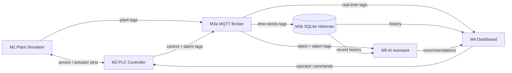

# Smart Beverage Pasteurization & Bottling Line — Digital Twin

**TUMA206 Group 1 — Final Submission**

A complete industrial digital twin of a beverage pasteurization and bottling line, built as a pure-Python implementation of the Purdue enterprise reference architecture. The system spans five ISA-95 layers: physical process simulation → PLC control → MQTT data transport → operator dashboard → AI-assisted diagnostics. Every module has explicit input/output pins, a single responsibility, and a documented port specification.

---

## Deployment

This project can be run in two ways:

### Option A — Streamlit Cloud (recommended for demo / evaluation)

The application is deployed and live at:

> **https://tuma206mdi-beverage-digital-system.streamlit.app/**

No installation, no API key, no configuration required. Opens directly in a browser. The dashboard runs with the in-process message bus and rule-based AI fallback — all features work out of the box. For Claude-powered AI diagnostics, enter an Anthropic API key in the ALARMS page sidebar (the key is only stored in your browser session and never persisted).

### Option B — Local Deployment (recommended for development / customisation)

**Prerequisites:** Python 3.10+, `pip`, and a terminal (Windows PowerShell / macOS Terminal / Linux shell).

**Step-by-step:**

```bash
# 1. Clone or download the repository to your computer
#    (if using Git)
git clone <repository-url> TUMA206-main-Final
cd TUMA206-main-Final

#    (if using a ZIP download)
#    Extract the ZIP, open a terminal in the extracted folder.

# 2. (Recommended) Create and activate a virtual environment
python -m venv .venv

#    Windows:
.venv\Scripts\activate

#    macOS / Linux:
source .venv/bin/activate

# 3. Install dependencies
pip install -r requirements.txt

# 4. Launch the dashboard
streamlit run dashboard/app.py
```

The dashboard opens at `http://localhost:8501`. All three pages (SCHEMATIC, TRENDS, ALARMS) are available. The system runs entirely on your machine — no internet connection required for the core simulation and dashboard. The AI assistant works in rule-based mode by default; to enable Claude-powered answers, enter an API key on the ALARMS page.

**Optional — enable real MQTT broker (advanced):**

```bash
# Set the environment variable before launching:
#   Windows:  set USE_MQTT=1
#   macOS/Linux: export USE_MQTT=1
streamlit run dashboard/app.py
```

Requires a running Mosquitto broker on `localhost:1883`. The dashboard will publish and subscribe to real MQTT topics (`btl/tags`, `btl/cmd`) instead of using the in-process bus.

### Option C — Distributed: cloud dashboard + local backend over MQTT (the ISA-95 split)

This is the topology where the **cloud dashboard runs the display only** and **all control/simulation runs locally**, with **MQTT** as the link between them — matching the Purdue / ISA-95 layering (L0 sensors → L1 controller → L2/L3 historian → MQTT → L4/L5 cloud dashboard). The dashboard never controls the machine directly: every operator action is published as an MQTT command (`btl/cmd`) and executed by the local backend, which publishes the live tag stream back (`btl/tags`).

```bash
# 1. Start an MQTT broker reachable by BOTH sides.
#    Local single-laptop demo:  mosquitto -p 1883   (edit MQTT_HOST/PORT in config.py
#    if you use a hosted/public broker so the cloud app can reach it too)

# 2. Start the local backend (M1 plant + M2 PLC + M3 historian, publishes to MQTT):
python local_backend.py

# 3. Start the dashboard in DISPLAY-ONLY mode (runs no simulation, reads MQTT):
#    Windows PowerShell:  $env:DASHBOARD_MODE="remote"; streamlit run dashboard/app.py
#    macOS/Linux:         DASHBOARD_MODE=remote streamlit run dashboard/app.py
```

| Process | Runs | Modules | Talks to broker via |
|---------|------|---------|--------------------|
| `local_backend.py` | local machine | M1 + M2 + M3 historian | publishes `btl/tags`, subscribes `btl/cmd` |
| dashboard (`DASHBOARD_MODE=remote`) | cloud or local | M4 display + M5 AI only | subscribes `btl/tags`, publishes `btl/cmd` |

Without `DASHBOARD_MODE=remote` (the default `local`) the dashboard is self-contained and runs everything in-process — that is the mode used by the public Streamlit Cloud showcase, which needs no broker.

#### Broker: HiveMQ Cloud (free, internet-reachable — recommended for a real cloud dashboard)

`mosquitto` on `localhost` only works when the dashboard and backend share one machine. For a dashboard hosted on **Streamlit Cloud** the broker must be reachable from the internet, so use a free [HiveMQ Cloud](https://www.hivemq.com/mqtt-cloud-broker/) serverless cluster:

1. Create a free **Serverless** cluster, then under **Access Management → Add Credentials** create a username/password with **Publish and Subscribe** permission.
2. Copy the **Cluster URL** from the **Overview** tab. Connections use **TLS on port 8883**.
3. Configure both sides (local `.env` and the cloud dashboard's Streamlit secrets) with the **same** values:

```bash
MQTT_HOST=<your-cluster>.s1.eu.hivemq.cloud
MQTT_PORT=8883
MQTT_TLS=1
MQTT_USERNAME=<your_username>
MQTT_PASSWORD=<your_password>
MQTT_TOPIC_PREFIX=tuma206grp1bvg   # any string; both sides must match
```

For the Streamlit Cloud dashboard, also set `DASHBOARD_MODE = "remote"` in **Manage app → Settings → Secrets** (see `.streamlit/secrets.toml.example`).

> **Gotcha we hit:** if the broker's built-in **Web Client** connects fine but external clients (paho/MQTT Explorer) get `CONNACK: Not authorized` with the exact same credentials, the free serverless cluster is in a bad state — **delete it and create a fresh cluster**. This is a known HiveMQ Cloud free-tier issue, not a code/credentials problem. Also note some restrictive networks block the plaintext MQTT port `1883`; TLS `8883` is the reliable choice.

### Telegram alarm notifications (optional, L4 enterprise edge)

The local backend can push a Telegram message to your group every time an alarm fires — the same idea as the lecturer's reference `plant_ops_2026` bot. It runs on the **local backend** (where the engine and alarms live), not on the cloud dashboard, and it never blocks the control loop (messages are sent in a background thread).

**Setup (one-time):**

1. In Telegram, message **@BotFather** → `/newbot` → copy the **bot token** (looks like `123456789:AA...`).
2. Add the bot to your group (or just send it a direct message), then open
   `https://api.telegram.org/bot<TOKEN>/getUpdates` in a browser and copy the **chat id** (a group id looks like `-100...`).
3. Put both into `.env` (local) or Streamlit secrets:

```bash
TELEGRAM_BOT_TOKEN=123456789:AA...
TELEGRAM_CHAT_ID=-1001234567890
```

When set, `python local_backend.py` prints `Telegram alarms: on`, sends one "backend online" test message at startup, and then sends `[ALARM] ...` on every new alarm. If the variables are missing it stays silently off — nothing else changes.

**Optional — enable REST/WebSocket API (advanced):**

```bash
uvicorn backend.api:app --host 0.0.0.0 --port 8000
```

Exposes tag queries at `/api/tags/latest` and `/api/tags/history`, plus a WebSocket endpoint for live tag streaming. Useful for integrating with external monitoring tools.

**Quick smoke test** (no browser needed):

```bash
python run.py --ticks 30
```

Runs 30 ticks of the simulation headlessly and prints the final state.

---

## Table of Contents

1. [System Architecture](#system-architecture)
2. [Module Specification](#module-specification)
3. [Process Pipeline](#process-pipeline)
4. [Control Strategies](#control-strategies)
5. [Sequential Startup](#sequential-startup)
6. [Thermal Physics](#thermal-physics)
7. [Fault Injection & Alarm System](#fault-injection--alarm-system)
8. [Dashboard](#dashboard)
9. [Repository Structure](#repository-structure)
10. [Quick Start & Demo Plan](#quick-start--demo-plan)
11. [Key Configuration](#key-configuration)
12. [Technology Stack](#technology-stack)

---

## System Architecture

The system follows the **Purdue Enterprise Reference Architecture** (PERA), adapted for a single-line beverage process. The five modules map to ISA-95 functional layers:

```
ISA-95 Layer 4 (Enterprise)    M5 AI Assistant       —— diagnosis + operator recommendations
ISA-95 Layer 3 (Manufacturing)  M4 Dashboard          —— HMI: P&ID, trends, alarms, fault injection
ISA-95 Layer 2 (Control)        M3 Data Layer         —— MQTT pub/sub + SQLite historian
ISA-95 Layer 1 (Sensors)        M2 PLC Controller     —— state machine + PI control + fault detection
ISA-95 Layer 0 (Process)        M1 Plant Simulator    —— physics: thermal, flow, bottling
```



**Key architectural rule:** the closed-loop control path exists **only** between M1 (Plant) and M2 (PLC). M5 (AI) recommends operator actions but never directly controls actuators. M4 (Dashboard) injects faults and applies manual overrides through M2 — never bypasses it.

The system advances one **tick** per simulated second (`UPDATE_PERIOD_S = 1.0`). Each tick: M1 publishes sensor values → M2 reads them, runs control logic, outputs actuator commands → M1 applies commands → M3 publishes the combined tag snapshot and persists it to SQLite. The dashboard and AI assistant read from M3 asynchronously.

---

## Module Specification

### M1 — Plant Simulator (`simulator/plant.py`)

A physics-only model of the beverage line. Receives actuator commands from the PLC and fault-injection codes from the dashboard; produces sensor readings and feedback signals. Contains **no control logic** — all decisions live in M2.

```
module M1_PlantSimulator (
    // Actuator inputs (from M2)
    input  pump_cmd:            float  0..100%
    input  inlet_valve_cmd:     float  0..100%
    input  heater_power_cmd:    float  0..100%
    input  cooling_valve_cmd:   float  0..100%
    input  conveyor_cmd:        float  0..100%
    input  fill_valve_cmd:      int    0/1
    input  capper_cmd:          int    0/1
    input  fault_inject_code:   int    0..4
    input  reset_fault:         int    0/1

    // Sensor outputs (to M2)
    output tank_level:          float  0..100%
    output pasteur_temp:        float  degC
    output cooler_temp:         float  degC
    output flow_rate:           float  L/min
    output bottle_count:        int    bottles filled
    output bottles_completed:   int    bottles packed
    output conveyor_queue:      int    0..60 bottles on belt
    output pump_feedback:       int    0/1
    output valve_feedback:      int    0/1
    output fill_phase:          str    INDEX | FILL
    output fill_progress:       float  0.0..1.0
    output nozzle_status:       int[4] 0=idle 1=filling 2=full
    output fault_status:        int    0..4
)
```

**Physical models** (1-second update period):

| Subsystem | Model | Key Parameters |
|-----------|-------|---------------|
| Raw Tank | Mass balance: `inflow − outflow`. Inflow = 6.0 × valve%, outflow = 4.0 × pump% (in tank-%/tick). Clamped 0–100%. | Starts empty (0%), fills on START |
| Feed Pump | Proportional: `flow_rate = 40.0 × pump%` ± noise. Pump feedback active when commanded >0 and tank >0.5%. | 0–40 L/min |
| Pasteurizer | First-order heating + flow-through cooling + noise. Target = 25°C + heater% × 65°C (max 90°C). Time constant τ≈20s. | See [Thermal Physics](#thermal-physics) |
| Cooler | Pipe transit + active glycol HX. Pipe entry ~50–55°C. Active cooling drives toward 15°C floor. AUTO valve ~43% at 25°C. | See [Thermal Physics](#thermal-physics) |
| Filler | 4-nozzle inline monoblock phase machine. INDEX (gap 1–3 ticks) → FILL (progress = `flow×dt / 2000mL`) → batch discharge. | 500 mL/bottle, 4 bottles/carrier |
| Conveyor | Continuous float buffer. Discharge: `min(buffer, 1.5×conv%/100)` bottles/tick. Sub-bottle accounting via float accumulator. | Capacity 60, P-ctrl target 12 |

### M2 — PLC Controller (`plc/controller.py`)

A scan-cycle PLC emulation. Runs a 5-state machine, multiple PI/P control loops, and comprehensive fault detection every tick. Safety interlocks are **never bypassed** — even in manual mode — and fault detection runs regardless of auto/manual state.

```
module M2_PLCController (
    input  tank_level, pasteur_temp, cooler_temp, flow_rate,
    input  bottle_present, pump_feedback, valve_feedback,
    input  operator_start, operator_stop,
    input  manual_overrides:    Dict[str, float]

    output pump_cmd, inlet_valve_cmd, heater_power_cmd,
    output cooling_valve_cmd, conveyor_cmd,
    output fill_valve_cmd, capper_cmd,
    output alarm_code, plc_state, startup_phase
)
```

**State Machine:**

```
IDLE ──[START]──> STARTING(HEAT) ──[temp+level OK]──> STARTING(PRIME) ──[flow>5]──> RUNNING
  ^                    ^                                     |                          |
  |                    |                                     v                          |
  |                    └─────────────── [serious alarm] ─── FAULT ───[acknowledge]─────┘
  └───[STOP]──────────────────────────────────────── STOPPING ──[1t]── IDLE
```

**Control loops implemented:**

| Stage | Method | Detail |
|-------|--------|--------|
| S1 Inlet Valve | Feed-forward + P trim | FF = `pump% × 67%` (ratio of outflow 4.0 to inflow 6.0). P trim = `−3.0 × level_error`. Coordinated cascade with pump. |
| S1 Feed Pump | Proportional + smoothing | 30–100% proportional to tank level (30–80%). Smoothing 0.4. Computed first so inlet can feed-forward. |
| S2 Pasteurizer | PI + anti-windup + adaptive gain | Setpoint 72°C. Gain 1.5–5.0 based on flow rate. True anti-windup: blocks integration only when saturated AND error pushes deeper. |
| S3 Cooler | PI + anti-windup | Setpoint 25°C, gain 1.5. Anti-windup same as heater. |
| S4 Filler | Interlock + back-pressure | Valve opens when: pasteurized (≥68°C), cooled (≤28°C), flow >1 L/min, buffer <95% full. Plant handles fill-cycle timing internally. |
| S5 Conveyor | P-controller on buffer | `cmd = clamp(40 + 6×(buffer − 12), 20, 100)`. Autonomous: speeds up when bottles pile up, slows when buffer drains. |

### M3 — Data Layer

**M3a — Message Bus** (`messaging/bus.py`): Abstract pub/sub transport with two backends:
- `InProcessBus` — zero-configuration, default for local demos
- `MqttBus` — connects to Mosquitto broker for distributed operation (set `USE_MQTT=1`)

Tags published as a complete snapshot to `btl/tags` each tick. Operator commands arrive on `btl/cmd`.

**M3b — Historian** (`historian/store.py`): SQLite time-series store. Records every tick's full tag snapshot. Dedicated columns for numeric tags enable efficient trend queries. CSV export via the TRENDS page. Default query window: 300 seconds. Database stored in system temp directory (works on Streamlit Cloud).

### M4 — Dashboard (`dashboard/`)

Three-page Streamlit HMI with shared engine singleton (`dashboard/shared.py` — `@st.cache_resource` ensures all pages share one engine and one AI assistant instance):

| Page | Components |
|------|-----------|
| **SCHEMATIC** | SVG industrial P&ID (7 animated equipment nodes: 2 pumps, tank, pasteurizer, cooler, filler ×4, conveyor). Stage detail cards (S1–S5). KPI summary (6 metrics). Manual override panel (per-actuator checkbox + slider). Fault injection panel. START / STOP / **HARD RESET** buttons (full factory reset — clears all state, history, caches). Refresh rate control. |
| **TRENDS** | 2×2 sensor chart grid (Pasteur Temp with safe-band lines, Tank Level, Flow Rate, Bottles Capped). Actuator charts (Heater Power, Cooler Temp & Valve dual-axis). Per-chart FREEZE/UNFREEZE (snapshots dataframe; chart always rendered, Plotly `uirevision="constant"` preserves zoom). CSV export. IDLE rows filtered from all plots. |
| **ALARMS** | Status row (PLC, Alarm, Fault). Auto-diagnosis panel on active alarm (confidence + engine + recommendation). **"Force Analysis"** button — triggers fresh diagnosis when alarm active, or **system health check** when idle. **AI consultation chat** with 4 context-aware quick-action buttons (Diagnose Alarm, Analyze State, Recovery Steps, Risk Check) — clean display labels, full context sent to AI. Free-form input **outside auto-refresh fragment** (no mid-type resets). Alarm event log with distribution. In-UI API key (hot-swap). |

### M5 — AI Assistant (`ai_assistant/assistant.py`)

Dual-engine operator support:

1. **Claude API** (Anthropic): Activated when API key is provided (via env var or ALARMS page sidebar). Sends live process tags, active alarm code, and recent trend history as context. The `CONSULT_SYSTEM_PROMPT` provides the model with the complete process specification (5 stages, setpoints, limits). Returns concise operator-facing diagnosis and safe action recommendations. **Never commands actuators directly.** Gracefully falls back to rule-based on API errors.
2. **Rule-based fallback**: Much more than static advice — `_consult_with_rules()` analyses live sensor data to build a structured response: current state summary (PLC, temperatures, level, flow, buffer), active alarm advice (from 8 alarm types), and a list of any out-of-range readings with specific warnings. Always available with zero configuration.

The `diagnose()` method handles automatic alarm-triggered diagnosis (used by the auto-diagnosis panel). The `consult(question, tags, history)` method supports free-form operator questions — used by the chat panel, quick-action buttons, and the "Force Analysis" system health check.

---

## Process Pipeline

```
[Inlet Pump] → [S1 Raw Tank] → [Feed Pump] → [S2 Pasteurizer] → [S3 Cooler] → [S4 Filler ×4] → [S5 Conveyor/Capper] → Output
```

| Stage | Equipment | Function | Key Variables | Setpoints / Limits |
|-------|-----------|----------|---------------|-------------------|
| S1 | Raw / Balance Tank | Receives raw beverage, buffers between supply and production demand | Level: 0–100% | Target 55%, range 30–80%, critical 15–90% |
| S2 | Pasteurizer | Heats product to eliminate pathogens (thermal treatment) | Temperature: ambient–90°C | Setpoint 72°C, safe band 68–78°C |
| S3 | Cooler | Cools product to safe bottling temperature via glycol heat exchanger | Temperature: 15–55°C | Setpoint 25°C, bottling limit 28°C, alarm at 32°C |
| S4 | Inline Filler | Fills 4 bottles simultaneously on one carrier in lockstep | Flow rate, fill progress, nozzle status (×4) | 500 mL/bottle, 4 nozzles per carrier |
| S5 | Conveyor / Capper | Accumulation buffer → capper → packed output. P-controlled belt speed. | Buffer level: 0–60 bottles | P-ctrl target 12 bottles, alarm at ≥54 |

**Product flow:** Raw beverage enters S1 through the inlet pump. The feed pump draws from the tank and pushes product through S2 (heated to 72°C) and S3 (cooled to 25°C). Inter-stage pipe between S2 and S3 provides passive ambient cooling. At S4, cooled product fills bottles in batches of 4. Filled carriers discharge to the S5 accumulation buffer, where the conveyor/capper moves bottles downstream at a P-controlled rate matching the buffer level.

---

## Control Strategies

### S1 — Tank Level Cascade Control

**Problem:** Two actuators (inlet valve, feed pump) control one variable (tank level). Independent P-controllers on both sides fight each other — when level drops, the inlet opens AND the pump slows, causing overshoot in both directions.

**Solution: Feed-forward cascade.** The pump is the master (sets production rate), the inlet is the slave (matches consumption).
- **Feed pump** (computed first): Speed proportional to tank level. 30% at LOW (30%) → 100% at HIGH (80%), smoothed with factor 0.4.
- **Inlet valve** (computed second): Feed-forward baseline from pump consumption: `FF = pump% × (4.0/6.0) × 100` — the ratio of maximum outflow (4.0 u/t) to maximum inflow (6.0 u/t). A P-trim `±3.0 × level_error` corrects tank level deviations around the FF baseline.

**Result:** Level stable at 55.0% ±2%, no oscillation, coordinated pump-inlet movement.

### S2 — Pasteurizer PI with Adaptive Gain

**Problem:** The pasteurizer must reject a variable thermal load — cold product (25°C) continuously enters, absorbing heat. Higher flow = more cold mass = faster heat loss. A fixed-gain PI would be sluggish at high flow (undershoot) or aggressive at low flow (overshoot).

**Solution:** Flow-adaptive integral gain with true anti-windup:
- Flow >35 L/min → gain 5.0 (rapid response to high thermal load)
- Flow 20–35 L/min → gain 3.0
- Flow 8–20 L/min → gain 2.0
- Flow <8 L/min → gain 1.5 (gentle, low thermal load)

True anti-windup: integration blocked only when `(heater ≥ 100% AND error > 0)` OR `(heater ≤ 0% AND error < 0)`. When the error sign reverses (temp crosses setpoint), integration resumes immediately — no overshoot from wound-up integral.

### S3 — Cooler PI with Pipe Transit

**Problem:** Product arrives at the cooler HX at 50–55°C (after ~40% passive cooling in the inter-stage pipe). The glycol HX must actively remove the remaining heat. The operator needs visible confirmation that cooling is working.

**Solution:** PI controller with gain 1.5. The physics model gives the valve meaningful authority: at normal flow, AUTO valve settles at ~43% — clearly visible active cooling. Manual low valve (5–10%) drives temperature above the 32°C alarm threshold. Manual high valve (80%) achieves sub-20°C product.

### S4 — Filler Interlock + Flow-Driven Timing

**Problem:** The filler must never dispense unpasteurized (>68°C required) or uncooled (<28°C required) product. Fill timing should reflect available flow rate — faster flow fills bottles faster.

**Solution:** Two hard interlocks gate the fill valve: pasteurized AND cooled. The plant's phase machine handles timing:
- INDEX gap: `max(1, min(3, 12/flow_rate))` ticks — dynamically adjusts cadence to flow rate
- FILL progress: `flow_rate × 1000/60 × UPDATE_PERIOD_S / (500 × 4)` fraction/tick — directly proportional to flow
- Batch discharge when progress ≥1.0 → 4 bottles enter conveyor buffer

At 28 L/min: ~4.3 ticks to fill, gap=1 → ~5 ticks per carrier → ~48 bottles/min.

### S5 — Conveyor Buffer P-Controller

**Problem:** The batch filler (4 bottles every ~5 ticks) and continuous capper operate at different cadences. Without buffering, the capper would starve or the filler would back-pressure.

**Solution:** Accumulation buffer (0–60 bottles) with autonomous P-controller: `cmd = clamp(40 + 6×(buffer − 12), 20, 100)`. When the filler outpaces the capper, buffer grows → belt speeds up → discharge rate increases → buffer shrinks. Self-regulating, no operator intervention needed.

---

## Sequential Startup

The line does not start all actuators at once. A three-phase sequencer ensures each stage is process-ready before the next activates — preventing cold product from reaching the filler or hot product from entering the cooler.

| Phase | PLC State | Inlet | Heater | Pump | Filler | Conveyor | Transition |
|-------|-----------|-------|--------|------|--------|----------|------------|
| **HEAT** (0) | STARTING | AUTO (fills tank from 0%) | **100%** rapid warm-up | **OFF** | OFF | OFF | `temp ≥ 68°C` AND `cooler ≤ 28°C` AND `tank ≥ 30%` |
| **PRIME** (1) | STARTING | AUTO (FF+P) | AUTO (PI) | **0→40% ramp** | OFF | OFF | `flow > 5 L/min` |
| **RUNNING** (2) | RUNNING | AUTO (FF+P) | AUTO (PI) | AUTO (P) | AUTO (interlock) | AUTO (P-ctrl) | — |

**Design rationale:**
- During HEAT, the pump is off because cold product would draw heat from the pasteurizer, slowing warm-up. The tank fills from empty while the pasteurizer and cooler reach their targets.
- During PRIME, the pump starts slowly (ramps at 3%/tick) to avoid a cold slug hitting the pasteurizer. Flow builds gradually. Filler remains off until flow is established.
- Tank alarms (TANK_OVERFLOW, TANK_EMPTY) are suppressed during HEAT because the pump is off — a full tank is safe (inlet also closes when high), and an empty tank isn't dangerous when not drawing. After a fault recovery, PRIME will safely drain a full tank.

Manual override of any actuator bypasses the sequencer for that actuator only — the rest continue their sequenced progression.

---

## Thermal Physics

### Pasteurizer (S2)

Three-term model at 1-second resolution:

1. **Heating** — First-order approach to heater-driven target: `temp += 0.05 × (target − temp)`. Target = `25°C + heater% × 65°C` (0% → 25°C, 100% → 90°C). Time constant τ ≈ 20 seconds.

2. **Flow-through cooling** — Cold beverage continuously enters, absorbs heat, and exits. The dominant thermal disturbance: `temp −= 0.012 × flow_factor × (temp − 25°C)`. At normal flow (~28 L/min, factor 0.7) and 72°C: removes ~0.4°C/tick.

3. **Process noise** — ±0.04°C (sensor-grade thermocouple jitter).

**Steady state:** Heater output ≈ 84% to maintain 72°C at normal flow. The PI controller's adaptive gain (1.5–5.0) compensates for variable cooling load across the flow range.

### Cooler (S3)

Three-term model — the HX has no ambient drift term (pipe transit already handles passive losses):

1. **Pipe transit cooling** (ambient heat loss between S2 and S3): `pipe_temp = 72°C − 0.50×(1−0.3×flow_factor)×(72−25°C)`. At normal flow: pipe entry ≈ 53°C. Faster flow = less pipe residency = less cooling = hotter HX inlet.

2. **Inlet heating** (hot product entering HX): `temp += 0.08 × flow_factor × (pipe_temp − temp)`. Stronger than the ambient-only model — represents the continuous thermal load of hot incoming product.

3. **Active glycol cooling** (HX driven by valve): `temp += 0.30 × valve% × (15°C − temp)`. The 15°C floor represents cold glycol supply temperature. The 0.30 coefficient gives the valve meaningful authority across its full range.

**Valve authority map** (steady-state, flow ≈ 28 L/min, pipe ≈ 53°C):

| Valve | Temperature | System State |
|-------|------------|-------------|
| 0% (off) | ~53°C | No active cooling, pipe transit only |
| 10% | ~40°C | **COOLER_HIGH alarm** (exceeds 32°C) |
| 30% | ~30°C | Near bottling limit (28°C) |
| **43% (AUTO)** | **25°C** | PI setpoint — clearly active, substantial headroom |
| 60% | ~23°C | Actively chilled |
| 80–100% | ~22°C | Maximum toward 15°C floor |

---

## Fault Injection & Alarm System

The assignment requires exactly **four faults, one per ISA-95 layer**, each detected and diagnosed within **≤60 seconds**. All four are injected from the SCHEMATIC sidebar and trigger the AI assistant on the ALARMS page.

### Injected Faults — ISA-95 Coverage

| Code | ISA-95 Layer | Injected Fault | Alarm | Detection Time | Detection Method |
|------|-------------|----------------|-------|---------------|-----------------|
| **1** | **L1: Sensor / Actuator** | Temperature sensor output freezes at the value read when the fault is injected | SENSOR_TEMP_STUCK (10) | **~3 seconds** | Dual-mode: (a) heater command moves >5% but reported temp frozen <0.1°C for 3 ticks, OR (b) temp exactly frozen <0.001°C for 3 ticks (injected at setpoint) |
| **2** | **L2: Equipment / Control** | Feed pump motor fails — pump feedback goes to 0, flow drops to 0 despite command ON | PUMP_NO_FLOW (20) | **~3 seconds** | Pump commanded ON, pump feedback = 0, flow rate ≤ 0.1 L/min for 3 consecutive ticks |
| **3** | **L3: Process / Manufacturing** | Heater control element fails in the ON position — temperature runs away above the safe band | TEMP_OUT_OF_RANGE (30) | **~11 seconds** | Pasteurizer temperature outside 68–78°C for 3 ticks after warm-up. Fault drives heater target to 98°C to overcome flow-through cooling. **Auto-clears** when temperature returns to safe band. |
| **4** | **L4: Infrastructure / Enterprise** | MQTT broker process dies — tag stream stops, last published values remain frozen on dashboard | DATA_STALE (40) | **Instant** (no debounce) | Engine simulates stale condition; `data_stale_flag` set on snapshot. Dashboard shows freeze banner. Physical line continues running but operator sees frozen data. |

### Process Alarms (not injected — triggered by process conditions)

| Code | Alarm | Trigger Condition | Auto-Clear | Typical Cause |
|------|-------|-------------------|-----------|---------------|
| 50 | TANK_OVERFLOW | Tank level ≥90% for 3 ticks (pump-active phases only) | No | Inlet valve forced open with pump stopped, or supply surge |
| 51 | TANK_EMPTY | Tank level ≤15% for 3 ticks (pump-active phases only) | No | Inlet valve closed with pump running, or supply exhaustion |
| 52 | BUFFER_HIGH | Conveyor buffer ≥54/60 bottles (90%) for 3 ticks | No | Conveyor speed too low relative to fill rate |
| 53 | COOLER_HIGH | Cooler outlet ≥32°C for 3 ticks | **Yes** (<32°C) | Cooling valve too low, or pump speed too high for cooler capacity |

### Detection Architecture

Fault detection runs **every tick** in `PLCController._detect_faults()` — regardless of manual/auto mode. Safety interlocks are never bypassed. Each alarm uses a 3-tick debounce counter (`ALARM_DEBOUNCE_TICKS`) to reject transient noise.

**Alarm priority** (higher-priority alarms pre-empt lower ones): DATA_STALE (instant, highest) > TANK_OVERFLOW > TANK_EMPTY > BUFFER_HIGH > COOLER_HIGH > TEMP_OUT_OF_RANGE > PUMP_NO_FLOW > SENSOR_TEMP_STUCK.

**Auto-clear behaviour:** TEMP_OUT_OF_RANGE and COOLER_HIGH auto-clear when the respective temperature returns to its safe band. The PLC transitions from FAULT → IDLE automatically. All other alarms require explicit operator acknowledgement via the RESET button (which calls `PLCController.acknowledge()`).

### AI Diagnosis

On alarm detection, the AI assistant receives:
- The active alarm code and its description
- The latest complete tag snapshot (all sensor + actuator values)
- Recent trend history (last 8 samples: temperature, flow, level)

It returns a structured diagnosis with:
- `diagnosis_label` — one-line fault identification
- `recommendation_text` — concrete, safe operator actions (120–150 words)
- `confidence_level` — HIGH (rule-based, deterministic match), MEDIUM (heuristic), or MODEL (Claude API)
- `engine` — "rule-based" or "claude (model-id)"

All four injected faults have dedicated rule-based advice that triggers in <1ms (no API call needed). With Claude API configured, the model receives full context and can provide more nuanced analysis.

---

## Dashboard

### Page 0 — SCHEMATIC

- **SVG industrial P&ID**: 7 equipment nodes in horizontal pipeline (`viewBox="0 0 825 175"`, responsive). Each node drawn as an SVG `<g>` group with equipment-specific shapes: circular pumps with rotating triangular impellers, vertical tank with gradient liquid fill, pasteurizer with pulsing heating bars, cooler with opacity-driven coil points, filler with 4 bottle columns showing fill levels and animated fill streams, conveyor with moving bottle markers. Status-driven glow filters (green=ok, orange=warn, red=fault, grey=idle). Orange "M" badge on manually-overridden equipment.
- **Status banner**: Context-aware — "WARMING UP" (HEAT phase), "PRIMING PUMP" (PRIME phase), "NORMAL — PLC: RUNNING", or alarm details.
- **Nozzle status row**: 4 coloured dots (grey=IDLE, blue=FILLING, green=FULL) + fill phase + ASCII progress bar + percentage.
- **5 Stage detail cards**: S1 (Level, Inlet Valve, Feed Pump, Flow), S2 (Temp, Heater, Safe Band, Status), S3 (Temp, Cooler, Target, Limit), S4 (Flow Rate, Fill Valve, Phase, Progress), S5 (On Belt, Completed, Conveyor, Buffer Target).
- **6 KPI cards**: Level, Pasteur Temp, Cooler Temp, Flow Rate, Completed Bottles, PLC State + Tick.
- **Sidebar controls**: START / STOP / **HARD RESET** (full factory reset: stops engine, resets plant + PLC to initial state, clears all manual overrides, historian data, alarm logs, AI cache, chat history, and Trends freeze — returns the entire system to a clean slate), per-actuator manual override (checkbox → slider starts at current AUTO value → uncheck returns to AUTO with gradient recovery and debounce reset), fault injection (type selector → INJECT → RESET), refresh rate slider (1–10s).

### Page 1 — TRENDS

- **Sensor chart grid** (2×2): Pasteur Temp (with safe-band reference lines at 68/78°C), Tank Level, Flow Rate, Bottles Capped. Plotly `Scatter` traces with spline interpolation.
- **Actuator charts**: Heater Power (0–100%, single trace), Cooler Temperature & Valve (dual y-axis: temp 0–35°C, valve 0–105%). Alarm events marked as vertical dashed lines.
- **Per-chart FREEZE**: Snapshots the current dataframe into `st.session_state`. The chart is always rendered (same data → Plotly preserves zoom/pan via `uirevision="constant"`). Data accumulates in the background. Unfreeze clears the snapshot and the chart catches up to live data.
- **IDLE filtering**: Rows with `plc_state == "IDLE"` are removed from the dataframe before plotting to eliminate vertical cliffs during line stops.
- **CSV export**: Writes the current window's history to `history_export.csv` in the system temp directory.

### Page 2 — ALARMS

- **Status row**: 3-column metric display (PLC State, Active Alarm with ACTIVE/CLEAR delta, Fault Status).
- **Inline sensor strip**: Pasteurizer temp (green/red by safe band), tank level (green/orange), flow rate, cooler temp, buffer count — all colour-coded by safety status.
- **Auto-diagnosis panel**: When an alarm is active, shows diagnosis label with warning icon, confidence badge (HIGH/MEDIUM/MODEL), engine identifier, and full recommendation text. Cache keyed on `{alarm_code}_{sensor_fingerprint}` — prevents stale diagnoses while refreshing for new conditions.
- **"Force Analysis" button** (sidebar): Clears cache and forces a fresh diagnosis when an alarm is active. When **no alarm is active**, triggers a **system health check** — builds a context-aware prompt from live sensor data and displays the AI's assessment in the diagnosis panel. Useful for pre-emptive process monitoring.
- **AI consultation section** (rendered **outside** the auto-refresh fragment — typing is never interrupted by refresh):
  - **4 quick-action buttons**: Diagnose Alarm, Analyze State, Recovery Steps, Risk Check. Each sends a context-rich prompt (live sensor values + alarm state) to the AI but displays a **clean label** ("Requested: Process Analysis") in chat — no raw technical strings.
  - **Chat history panel**: Scrollable (max-height 360px, last 20 messages), distinct user/AI styling ("Operator" in blue, "AI Assistant" in green). Supports markdown rendering with line breaks.
  - **Free-form text input** + "Ask" button: Type any question about the process, alarms, or recovery. Context is always included.
- **Rule-based fallback**: Without an API key, the AI provides a structured sensor analysis — current state summary, active alarm advice (if any), and a list of specific warnings for out-of-range readings. Substantially more useful than a static message.
- **Alarm event log**: Sortable table (time, label, description) with alarm type distribution metrics (up to 6 columns).
- **API key input**: Password-type text field in sidebar. Hot-swaps the Anthropic client on change — no restart required. Status indicator shows "Claude" or "Rule-based".

---

## Repository Structure

```text
README.md                       # This document — complete system specification
config.py                       # All constants, setpoints, fault/alarm codes, clamp()
requirements.txt                # Python dependencies (streamlit, plotly, pandas, paho-mqtt, anthropic)

simulator/
  plant.py                      # M1 — physics-only model: thermal, flow, bottling, fault behaviour

plc/
  controller.py                 # M2 — state machine, PI/P control, 8 fault detectors, manual override adaptation

engine/
  __init__.py                   # Package, exports SimulationEngine + RemoteEngineProxy
  runtime.py                    # Closed-loop M1↔M2 wire-up, background thread, operator command API, alarm→Telegram
  remote.py                     # RemoteEngineProxy — display-only dashboard client driven purely over MQTT

messaging/
  bus.py                        # M3a — InProcessBus (default) / MqttBus (auth + TLS, for HiveMQ Cloud)

historian/
  store.py                      # M3b — SQLite schema auto-creation, record(), recent(), recent_alarms(), export_csv()

notifications/
  telegram.py                   # L4 enterprise edge — pushes [ALARM] messages to Telegram on each alarm (optional)

ai_assistant/
  assistant.py                  # M5 — OpenAI / Anthropic auto-detected (diagnose + consult) + rule-based fallback

local_backend.py                # On-premise runner: engine + MQTT publish/subscribe + Telegram (distributed mode)

dashboard/
  app.py                        # Streamlit entry point — st.navigation([SCHEMATIC, TRENDS, ALARMS])
  shared.py                     # @st.cache_resource singletons — all pages share one engine + one assistant
  svg_pid.py                    # SVG P&ID builder — 7 equipment nodes, animated, status-driven
  SCHEMATIC.py                  # Page 0 — Process flow P&ID + stage cards + KPIs + controls
  pages/
    1_Trends.py                 # Page 1 — 2×2 sensor charts + actuator charts + per-chart freeze
    2_Alarms.py                 # Page 2 — Auto-diagnosis + consultation chat + event log + API key

backend/
  api.py                        # FastAPI REST + WebSocket (optional, for distributed deployment)

run.py                          # CLI smoke test: python run.py --ticks 30
```

---

## Quick Start & Demo Plan

### Running the Application

```bash
pip install -r requirements.txt
streamlit run dashboard/app.py
```

No API key, MQTT broker, or database setup required — everything runs locally with in-process message bus and SQLite. For Claude-powered AI diagnostics, enter an Anthropic API key on the ALARMS page sidebar. Terminal smoke test: `python run.py --ticks 30`.

### Demonstration Sequence (10 Steps)

1. **Launch** — Open `http://localhost:8501`. The SCHEMATIC page shows the SVG P&ID with all equipment in IDLE (grey) state. Tank at 0%.
2. **Start** — Press **START**. Banner shows "WARMING UP". Tank fills from 0%, inlet pump opens (visible on SVG). Pasteurizer heating bars pulse at 100%. Cooler valve adjusts. After ~22 ticks: "PRIMING PUMP" — pump impeller begins spinning, flow builds. After ~24 ticks: "NORMAL" — full production.
3. **Observe P&ID** — Pump impellers rotate (CSS spin animation), pipes glow blue with flowing dashes, heating bars pulse, filler nozzles show blue fill streams descending into bottles, conveyor bottle markers translate along the belt. Equipment borders glow green (normal).
4. **Check Trends** — Switch to TRENDS page. 2×2 sensor charts and actuator charts update in real time. Press **FREEZE** on the sensor chart — the chart stays put but continues accumulating data. Zoom/pan freely. Press **UNFREEZE** to catch up to live.
5. **Inject Fault 1** (Sensor, ISA-95 L1) — On SCHEMATIC, select "Temperature sensor stuck" → **INJECT**. Within 3 seconds: SENSOR_TEMP_STUCK alarm, line enters FAULT, all equipment grey. Switch to ALARMS: auto-diagnosis panel appears with "Temperature sensor fault — Do NOT trust the temperature interlock" (confidence: HIGH).
6. **Recover + Inject Fault 2** (Equipment, ISA-95 L2) — Press **RESET** → **START**. Line restarts. Inject "Feed pump failure". Within 3 seconds: PUMP_NO_FLOW alarm. AI advises "Check motor breaker, pump coupling, inlet blockage."
7. **Inject Fault 3** (Process, ISA-95 L3) — RESET → START. Inject "Temperature excursion". Pasteurizer temp begins climbing (visible on TRENDS and P&ID glow turning red). Within ~11 seconds: TEMP_OUT_OF_RANGE alarm. AI advises "Divert or quarantine product." RESET the fault — temperature drops, alarm **auto-clears**, line resumes automatically.
8. **Inject Fault 4** (Infrastructure, ISA-95 L4) — Inject "Data link stale". Dashboard immediately freezes with "DATA LINK FROZEN" banner. All displayed values are frozen at last-known-good. RESET to restore.
9. **Manual Override Test** — Check "Cooler" → slider starts at ~43% (current AUTO value). Drag to 5% → cooler temp rises past 32°C → **COOLER_HIGH alarm** fires. AI panel activates. Uncheck Cooler → smooth gradient return to AUTO, temp drops, alarm **auto-clears**. Try "Inlet Pump" 100% + "Feed Pump" 0% → tank fills to 100% → **TANK_OVERFLOW**. RESET → START — tank drains safely during PRIME phase, no re-trigger.
10. **AI Consultation** — On ALARMS page, enter an Anthropic API key in the sidebar (or skip for rule-based). Use quick-action buttons: "Analyze State" → AI reviews all process values and identifies any risks. "Recovery Steps" → step-by-step restart procedure. Type a custom question: "What would happen if I increase pump speed to 90%?" → context-aware answer.

> **Advanced deployment:** Set `USE_MQTT=1` for a real Mosquitto MQTT broker. Run `uvicorn backend.api:app` for REST/WebSocket API at `http://localhost:8000`. The backend exposes `/api/tags/latest`, `/api/tags/history`, and a WebSocket endpoint for live tag streaming.

---

## Key Configuration

All configurable constants live in `config.py`. Changing a value here updates every module consistently.

| Constant | Value | Module(s) | Meaning |
|----------|-------|-----------|---------|
| `UPDATE_PERIOD_S` | 1.0 s | M1, M2, M3 | Simulated time represented by one tick |
| `TANK_LEVEL_TARGET` | 55% | M2 | Inlet valve FF+P trim setpoint |
| `TANK_LEVEL_LOW` | 30% | M2 | Inlet valve full-open threshold; pump minimum |
| `TANK_LEVEL_HIGH` | 80% | M2 | Inlet valve full-close threshold; pump maximum |
| `TANK_LEVEL_MIN_PUMP` | 10% | M2 | Pump dry-run protection — forced off below this |
| `TANK_CRITICAL_HIGH` | 90% | M2 | TANK_OVERFLOW alarm (pump-active phases) |
| `TANK_CRITICAL_LOW` | 15% | M2 | TANK_EMPTY alarm (pump-active phases) |
| `PASTEUR_SETPOINT` | 72°C | M2 | Heater PI setpoint |
| `PASTEUR_SAFE_MIN` | 68°C | M1, M2 | Lower safe temperature bound; fill interlock |
| `PASTEUR_SAFE_MAX` | 78°C | M1, M2 | Upper safe temperature bound; TEMP_OUT_OF_RANGE threshold |
| `COOLER_SETPOINT` | 25°C | M2 | Cooler PI setpoint |
| `COOLER_FLOOR` | 15°C | M1 | Coldest achievable temperature at 100% cooling valve |
| `COOLER_MAX_BOTTLING` | 28°C | M2 | Fill interlock — filler won't open above this |
| `COOLER_ALARM_HIGH` | 32°C | M2 | COOLER_HIGH alarm threshold |
| `AMBIENT_TEMP` | 25°C | M1 | Ambient / room temperature; pipe cooling reference |
| `FILL_NOZZLES` | 4 | M1 | Parallel nozzles filling in lockstep per carrier |
| `FILL_VOLUME_ML` | 500 mL | M1 | Nominal bottle volume — determines fill time vs flow |
| `CONVEYOR_MAX_BOTTLES` | 60 | M1, M2 | Buffer belt capacity |
| `CONVEYOR_TARGET_BUFFER` | 12 | M2 | P-controller buffer setpoint |
| `CONVEYOR_BOTTLES_PER_TICK_AT_100` | 1.5 | M1 | Discharge throughput at 100% belt speed |
| `ALARM_DEBOUNCE_TICKS` | 3 | M2 | Consecutive abnormal ticks required to latch any alarm |
| `DATA_STALE_TIMEOUT_S` | 5.0 | M3 | Mark data stale if bus hasn't published within this window |
| `HISTORY_WINDOW_S` | 300 | M4 | Default trend chart query window |
| `ANTHROPIC_MODEL` | claude-sonnet-4-20250514 | M5 | Claude model for AI diagnosis and consultation |
| `ANTHROPIC_MAX_TOKENS` | 400 | M5 | Response token limit (keeps operator advice concise) |

---

## Technology Stack

| Layer | Technology | Justification |
|-------|-----------|---------------|
| Dashboard (M4) | **Streamlit + Plotly + CSS/HTML** | Rapid HMI development with native live refresh via `@st.fragment(run_every=...)`. Plotly provides interactive, publication-quality charts. CSS Grid and inline SVG enable professional industrial P&ID rendering. |
| Backend (M2, M3, M5) | **Python** (dataclasses, threading) | Single language across the entire stack. Dataclass-based modules with explicit input/output pins match the RTL port-specification design philosophy. |
| API (optional) | **FastAPI + paho-mqtt** | Clean REST endpoints for tag queries; WebSocket for live tag streaming to external consumers. |
| Database (M3b) | **SQLite + CSV export** | Zero-configuration, reproducible on any laptop. Sufficient for timestamped process values at 1 Hz. CSV export supports debugging and evidence collection. |
| Messaging (M3a) | **Mosquitto MQTT** (optional) / InProcessBus | Standard industrial IoT protocol for distributed operation. In-process fallback for single-machine demos — no external dependencies. |
| AI / LLM (M5) | **Claude Sonnet (Anthropic API)** | Clear technical reasoning, concise operator-facing recommendations, plain-language explanations. Rule-based fallback ensures the dashboard always shows advice — even offline. |
| Agent Framework | **Custom Python loop** | Transparent, explainable, and defensible. Single `diagnose()` / `consult()` call per interaction. Context injection limited to relevant tags and recent history — no black-box state. |

---

> **TUMA206 Group 1**
>
> Chen Zibo (03822012, ICD) · Ding Yuyao (03821587, ICD) · Lin Chen-Si (03821729, ICD)
> Nie Zhaorui (03821814, ICD) · Zhao Xinglong (03822679, ICD) · Siew Xuan Hui (03822086, ICD)
>
> **Modern Developments in Industry · 2025/26 Semester 2**
>
> Lecturer: Eldhose Abraham
